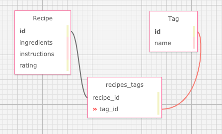

# _Recipe Box_

#### _The online home of your culinary creations, 10/14/2020_

#### By _**Vanessa Stewart, Joseph Karnafel, Brian Harvey**_

## Description

_This app allows users to upload their favorite recipes, complete with full CRUD/L functionailty for recipes. The tag function also allows users to sort and search Recipe Box for items with that tag. The original directions for the assignment include:_

Build an app that allows users to keep track of recipes. Before coding, think through the application's design using SQL Designer to visualize the relationships between tables and models.

As a user, I want to add a recipe with ingredients and instructions, so I remember how to prepare my favorite dishes.
As a user, I want to tag my recipes with different categories, so recipes are easier to find. A recipe can have many tags and a tag can have many recipes.
As a user, I want to be able to update and delete tags, so I can have flexibility with how I categorize recipes.
As a user, I want to edit my recipes, so I can make improvements or corrections to my recipes.
As a user, I want to be able to delete recipes I don't like or use, so I don't have to see them as choices.
As a user, I want to rate my recipes, so I know which ones are the best.
As a user, I want to list my recipes by highest rated so I can see which ones I like the best.
As a user, I want to see all recipes that use a certain ingredient, so I can more easily find recipes for the ingredients I have.

## Data Table Visualization

## Setup/Installation Requirements

1. Install Rails
- For this project, you will need Ruby. Follow the directions [here](https://www.learnhowtoprogram.com/ruby-and-rails/getting-started-with-ruby/ruby-installation-and-setup) for setting up Ruby.
- Install Rails on your machine with the following terminal command `gem install rails -v 5.2.0`

2. Clone Repo and Install Bundler
- Navigate to the directory on your local computer where you would like to clone this repo.
- Clone this repo using the `git clone` command in terminal/command line.
- Navigate to the cloned folder and run `gem install bundler` to install Bundler, which will mange all gem installations for our project.
- Run `bundle` or `bundle install` in your command line to download all dependencies. (If you add additional gems later, you will need to run `bundle update <gem name>`.)

3. Set Up Database
- Run `rake db:setup` in the terminal. This is akin to running the following rake tasks all at once: db:create(creates the dev and test databases for the current env), db:schema:load (recreates the database from the schema.rb file), and db:seed(runs the db/seed.rb file).

4. Open in Text Editor
- Open the cloned repo in a text editor of your choice.
- To Run Tests: While in the root directory of this project, run `rspec` in your command line.
- To Run the App in Browser: While in the root directory of the project, run `rails s` in the terminal. This will start a server, which you can access by entering `localhost:3000` in your browser.

## Known Bugs

_There are no known bugs at this time._

Items to Improve:
- Add integration tests.
- Add an additional class for Ingredients and create many to many relationship with it to recipes.

## Support and contact details

_For any questions or feedback, feel free to [contact Brian](mailto:brian.harv3y@gmail.com)._

## Technologies Used

* _HTML
* _CSS/Bootstrap_
* _Ruby/Ruby on Rails_

### License

*_This application operates under the GPL license._*

Copyright (c) 2020 **_Brian Harvey, Vanessa Stewart, Joseph Karnafel_**
